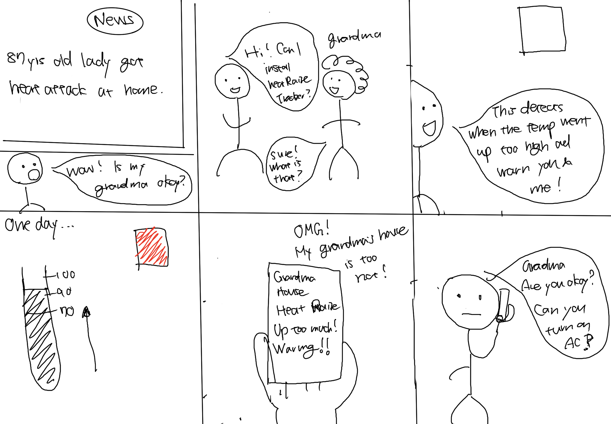
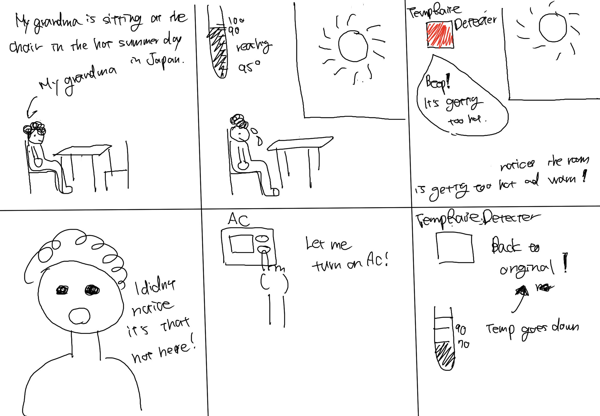
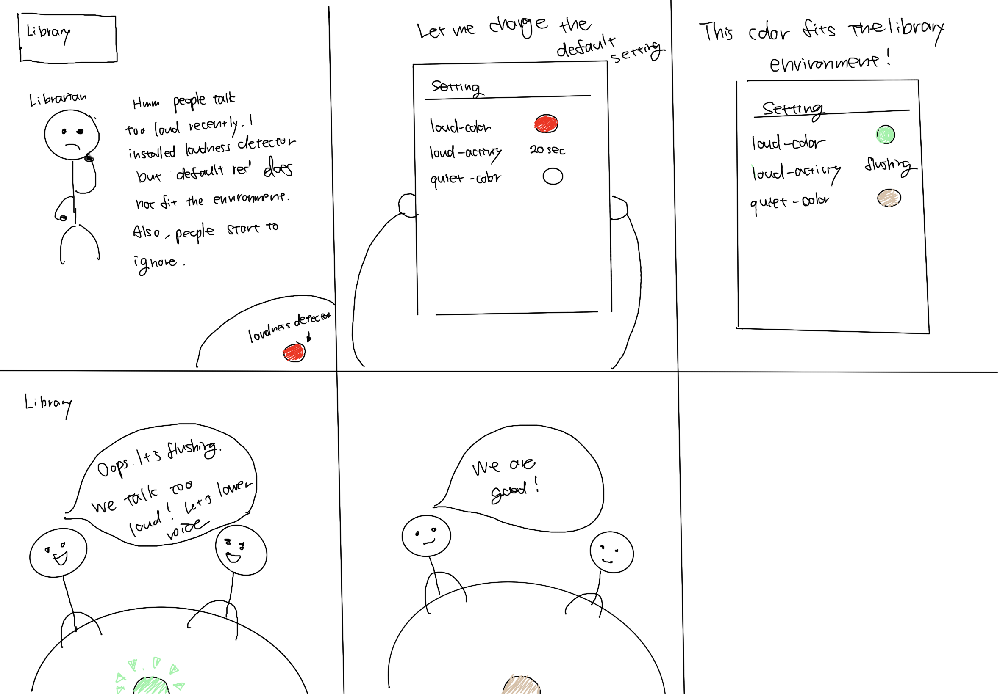
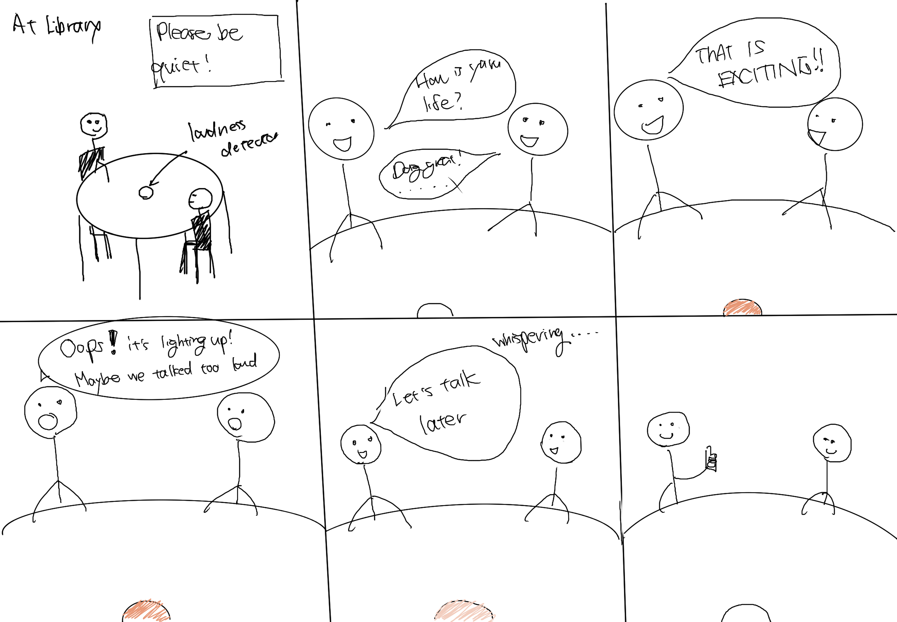
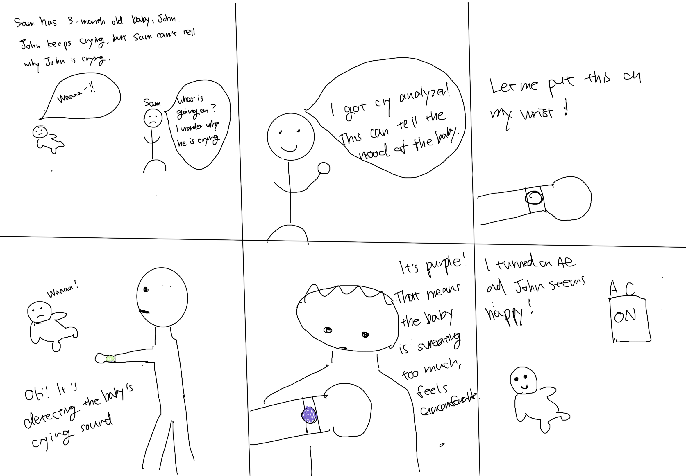
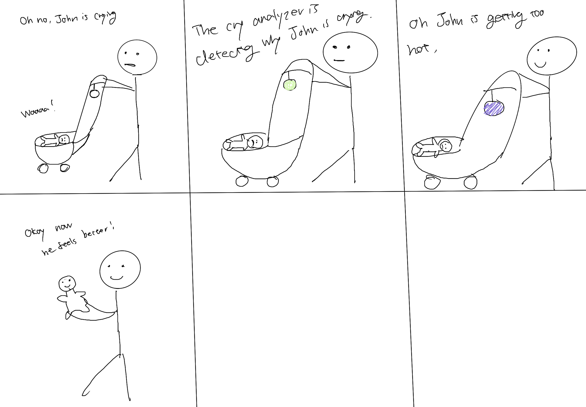
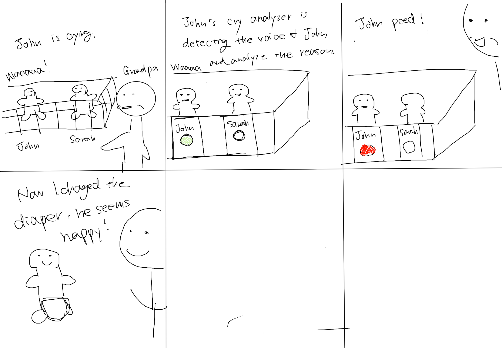

# Staging Interaction

**Nana Takada (nt388)**

  
Assignment Detais

In the original stage production of Peter Pan, Tinker Bell was represented by a darting light created by a small handheld mirror off-stage, reflecting a little circle of light from a powerful lamp. Tinkerbell communicates her presence through this light to the other characters. See more info [here](https://en.wikipedia.org/wiki/Tinker_Bell).

There is no actor that plays Tinkerbell--her existence in the play comes from the interactions that the other characters have with her.

For lab this week, we draw on this and other inspirations from theatre to stage interactions with a device where the main mode of display/output for the interactive device you are designing is lighting. You will plot the interaction with a storyboard, and use your computer and a smartphone to experiment with what the interactions will look and feel like.

_Make sure you read all the instructions and understand the whole of the laboratory activity before starting!_

## Prep

### To start the semester, you will need:
1. Read about Git [here](https://git-scm.com/book/en/v2/Getting-Started-What-is-Git%3F).
2. Set up your own Github "Lab Hub" repository by forking the [Interactive-Lab-Hub repository](https://github.com/FAR-Lab/Interactive-Lab-Hub). To get lab updates, simply [use GitHub's "Sync fork" button when new content is available](https://docs.github.com/en/pull-requests/collaborating-with-pull-requests/working-with-forks/syncing-a-fork).

3. Set up the README.md for your Hub repository (for instance, so that it has your name and points to your own Lab 1). You can [learn how to organize and format your README.md here](https://docs.github.com/en/get-started/writing-on-github/getting-started-with-writing-and-formatting-on-github/basic-writing-and-formatting-syntax). Make sure to include links to your submissions so they are easy to find.

### For this lab, you will need:
1. Paper
2. Markers/ Pens
3. Scissors
4. Smart Phone -- The main required feature is that the phone needs to have a browser and display a webpage.
5. Computer -- We will use your computer to host a webpage which also features controls.
6. Found objects and materials -- You will have to costume your phone so that it looks like some other devices. These materials can include doll clothes, a paper lantern, a bottle, human clothes, a pillow case, etc. Be creative!

### Deliverables for this lab are:
1. 7 Storyboards
1. 3 Sketches/photos of costumed devices
1. Any reflections you have on the process
1. Video sketch of 3 prototyped interactions
1. Submit the items above in the lab1 folder of your class [Github page], either as links or uploaded files. Each group member should post their own copy of the work to their own Lab Hub, even if some of the work is the same from each person in the group.

### The Report
This README.md page in your own repository should be edited to include the work you have done (the deliverables mentioned above). Following the format below, you can delete everything but the headers and the sections between the **stars**. Write the answers to the questions under the starred sentences. Include any material that explains what you did in this lab hub folder, and link it in your README.md for the lab.

## Lab Overview
For this assignment, you are going to:

A) [Plan](#part-a-plan)

B) [Act out the interaction](#part-b-act-out-the-interaction)

C) [Prototype the device](#part-c-prototype-the-device)

D) [Wizard the device](#part-d-wizard-the-device)

E) [Costume the device](#part-e-costume-the-device)

F) [Record the interaction](#part-f-record)

Labs are due on Mondays. Make sure this page is linked to on your main class hub page.

## Part A. Plan

<!-- To stage an interaction with your interactive device, think about:

_Setting:_ Where is this interaction happening? (e.g., a jungle, the kitchen) When is it happening?

_Players:_ Who is involved in the interaction? Who else is there? If you reflect on the design of current day interactive devices like the Amazon Alexa, it’s clear they didn’t take into account people who had roommates, or the presence of children. Think through all the people who are in the setting.

_Activity:_ What is happening between the actors?

_Goals:_ What are the goals of each player? (e.g., jumping to a tree, opening the fridge).

The interactive device can be anything *except* a computer, a tablet computer or a smart phone, but the main way it interacts needs to be using light. -->

<!-- \*\***Describe your setting, players, activity and goals here.**\*\* -->

**1 - Temp Raise Detector**

_Setting:_ Inside a home where an elderly person lives.

_Players:_ The elderly resident. Other people living in the same home. Friends or family members who are authorized to receive notifications.

_Activity:_ When the device detects that the room temperature is becoming dangerously high, it alerts the players through a lighting signal.
- The elderly resident can turn on the AC themselves.
- If they don’t notice, others in the household or notified family members can step in to ensure the AC is turned on

_Goals:_ Elderly people sometimes do not realize when the environment has become uncomfortably hot, which can lead to heat stroke indoors. The goal of the device is to use lighting as a clear alert to prompt someone—either the resident or others—to take action and cool the room.

**2 - Loudness Detector**
_Setting:_ A library or any room where people are expected to remain quiet. A loudness detector device is placed on each table.

_Players:_
- Individuals or groups sitting at the tables
- Other people present in the quiet space
- Individuals who will set the color for the loundess.

_Activity:_ The device monitors sound levels at each table.
- If the noise level exceeds a set threshold, the device alerts the group by changing its light (e.g., glowing red or pulsing).
- When the group lowers their voices, the light returns to a calm state by dimming.

_Goals:_ To gently remind people to keep their voices down, helping maintain a quiet environment for everyone in the space.

**3 - Cry Analyzer**

_Setting:_ At home, or in public places such as a subway station or restaurant, essentially anywhere babies may be present.

_Players:_
- Baby (or multiple babies)
- Parents
- Other caregivers (nannies, grandparents, relatives, etc.)

_Activity:_ The device continuously listens for baby cries.
- When a baby starts crying, the device analyzes the sound to infer the likely reason (e.g., hunger, discomfort, tiredness, needs a diaper change).
- If there are multiple babies, the device differentiates which baby is crying and signals accordingly (e.g., through distinct light colors or patterns).
- Caregivers notice the light and respond to the baby’s need.

_Goals:_ Babies cry for different reasons, and it is not always easy for caregivers to immediately recognize the cause. The goal of the Cry Analyzer is to provide a clear, light-based signal to caregivers, helping them quickly understand which baby is crying and why, so they can respond appropriately.

**4 - MoodLight**

_Setting:_ Inside the homes of our characters, including our main character, friends and family.

_Players:_
   - Individuals who want to communicate their moods.
   - Individuals who will set the color to indicate their feelings.

_Activity:_ When the user wants to share their mood with another they can add their friends/family member and alert them of their mood via light signal. Prompting the receiever to reach out.

-When person is having a mental health crisis
-When a person receives good news and wants to share their joy

_Goals:_ Some may want to share how they are feeling with others during a mental health episode, positive occasion or celebration. To provide a clear, light-based signal to the reciever so they understand what the sender is feeling and if they need help.

**5 - AirQuality Detector**

_Players:_
- Individuals or groups at home.
- Other people present a space.

_Activity:_ The device monitors air quality in a room.

- If the air quality exceeds a set threshold, the device alerts the room by changing its light (e.g., changing glow from green to orange or red plus possible pulsing).
-This can prompt someone in the room to turn on a fan or open the windows/doors.

_Goals:_ People sometimes do not realize when the environment's air quality has dropped. The goal of the device is to use lighting as a clear alert to prompt someone—either the resident or others—to take action and get good air flowing in the room.

<!-- Storyboards are a tool for visually exploring a users interaction with a device. They are a fast and cheap method to understand user flow, and iterate on a design before attempting to build on it. Take some time to read through this explanation of [storyboarding in UX design](https://www.smashingmagazine.com/2017/10/storyboarding-ux-design/). Sketch seven storyboards of the interactions you are planning. **It does not need to be perfect**, but must get across the behavior of the interactive device and the other characters in the scene.  -->

<!-- 

 -->

**Storyboards**

**Temperature Raise Detector**

**Loudness Detector**

**Cry Analyzer**

**Moodlight**

.jpg)
.jpg)
.jpg)
.jpg)
.jpg)

**AirQuality Detector**
.jpg)
.jpg)
.jpg)
.jpg)
.jpg)
.jpg)
.jpg)

<!-- Present your ideas to the other people in your breakout room (or in small groups). You can just get feedback from one another or you can work together on the other parts of the lab. -->

**Feedback**

Temperature Rise Detector:

The goals and the activity of the temp rise detector was clear. They think it's good idea especially after the grandma not noticing the temp raise. However, they are a bit worried about what if the gradma is not noticing when the light is turning. Also, they are worried whether the detector can tell if any action is taken or not.

Loudness Detector:

They think the scenarios are relatable. It’s easy to imagine this at a library or café. They like how it's in the every table so that the users can notice the loudness very easily. Also, they like the idea that the sers can customize the setting. They ae concerned about how to prevent people from ignoring the light.

Cry Analyzer:

They like that you showed multiple contexts, and they think the color-coded signals make it easy to know why the baby is crying.
They wonder how it behaves when the two babies are crying at once. Are they going to show the same color for the same reason? Also, they were worried about depending on the number of reasons, it requires a lot of memorization for caregivers.

Moodlight:  They like the multiple contexts, and they think the color-coded signals make it easy to know how one should react when notified of a mood change. It helps when one self isolates due to mental illness and can make one feel less alone. The gradients of color are fun and can encourage people to put specific words and colors to their feelings.

AirQuality Detector: They like how the airquality drop can be caused by multiple sources external or internal to the home. It is good to show a gradient of colors to indicate if the air quality is poor but not a danger and can help others monitor the air quality in the home. The notification to others helps if the monitor's alert is ignored or not seen by someone in the home.

## Part B. Act out the Interaction

Try physically acting out the interaction you planned. For now, you can just pretend the device is doing the things you’ve scripted for it.

<!-- \*\***Are there things that seemed better on paper than acted out?**\*\* -->
Color might not be enough to clearly understand what's the need from the baby needs. Users are required to remember all the associated colors. We realize we need an app that displays the details of why the baby is crying. We decided we only have hungry, tired, wet diapers, and others. Also, we decided that we want to have different flushing for emergencies/loudness of the baby’s cry. Low flushing for the low urgency, and high flushing for the high urgency.

Also, we realized that when the baby is crying, we do not want the light to be very bright, which will wake up the baby more. We want the light to be dim when the surroundings is dim.

When I try to hold the baby, I do not want to have anything that can harm the baby, so the something on the wrist might not be a good idea. It may be better to have the cry analyzer on the table or hang it on the side of the baby’s bed. Or the cry analyzer has to be made of a soft material like silicon.

When holding the baby, don't want it going off constantly if the baby is inconsolable, may want a feature that says the notification was seen and is being addressed. If a baby is crying for a reason addressed, such as trying to sleep, the parent might want to “snooze” the alert to see if in x minutes the baby is still restless.

As we discussed, we realized this would be helpful, especially for people with hearing disabilities.

In summary:
Cry analyzer
Detects only 4 types of cries (hungry, tired, wet diapers, and others), and details of others will be shown in the app
Analyzing the baby’s cry: Green
Hungry: Red
Tired/Sleepy: Yellow
Wet diapers: Brown
Others: Purple
Users can customize the four types of cries depending on the baby’s reasons for crying
Dim when the surroundings are dark
Snooze after x min
Soft material / place it on the desk, or hang it on the crib’s side

<!-- \*\***Are there new ideas that occur to you or your collaborator that come up from the acting?**\*\* ->

## Part C. Prototype the device

You will be using your smartphone as a stand-in for the device you are prototyping. You will use the browser of your smartphone to act as a “light” and use a remote control interface to remotely change the light on that device.

Code for the "Tinkerbelle" tool, and instructions for setting up the server and your phone are [here](https://github.com/IRL-CT/tinkerbelle).

We invented this tool for this lab!

If you run into technical issues with this tool, you can also use a light switch, dimmer, etc. that you can manually or remotely control.

\*\***Give us feedback on Tinkerbelle.**\*\*
When going onto the computer http, the instructions say to use http://[yourWiFiIPv4address]:5000, however sometimes the computer controller also needs to be on 5001 for it to work. I wish the names of the buttons were clearer, Jane Wren is not obvious as to if it would be the controller or recipient of the colors.

## Part D. Wizard the device
Take a little time to set up the wizarding set-up that allows for someone to remotely control the device while someone acts with it. Hint: You can use Zoom to record videos, and you can pin someone’s video feed if that is the scene which you want to record.

\*\***Include your first attempts at recording the set-up video here.**\*\*
Setup-video: https://drive.google.com/file/d/1BUSWfqz2VD0qCs84mbK93GCGri7xPBRh/view?usp=sharing

\*\***Show the follow-up work here.**\*\*
Follow-up work: https://drive.google.com/file/d/1WwWBHpumsBCVKSpRs7hg7XYgLydaZ-CJ/view?usp=drive_link

## Part E. Costume the device

Only now should you start worrying about what the device should look like. Develop three costumes so that you can use your phone as this device.

Think about the setting of the device: is the environment a place where the device could overheat? Is water a danger? Does it need to have bright colors in an emergency setting?
We want it to be waterproof & durable since babies can be messy. We want it to be large enough that it is not a choking hazard in case the baby gets to it.

\*\***Include sketches of what your devices might look like here.**\*\*

\*\***What concerns or opportunities are influencing the way you've designed the device to look?**\*\*

Concerns:
We initially considered creating something that is both soft/waterproof. However, as we designed, we realized that this object should not be inside the crib because the babies can touch or swallow the object.

Opportunities:
We see the opportunity that this cry analyzer can be seen without activating, since the parents need to hold their babies.
We came up with the idea of hanging it on the wall, which allows it to blend in with the interior and also requires no flat space, which is usually occupied with a lot of babies goods, and also be easily seen.
We assigned 4 core baby needs and assigned colors to them, hungry: red, tired:yellow, wet:brown, other:purple so it is easy to memorize what colors go with what and can customize using other.

## Part F. Record

\*\***Take a video of your prototyped interaction.**\*\*

Magnet: Video showing that the user can view the cry analyzer without touching or activating it.
https://drive.google.com/file/d/1hlJucOaVfujiwFWftl7v4ZgzT7LQfZO9/view?usp=drive_link

Hanging on the crib: Video where we show the user in a nursery with a crying baby who is sleepy, after putting the baby down we snooze the alert to check if the baby is still upset and cannot sleep.
https://drive.google.com/file/d/1Bn0LlyHdjucIiakMaQpu3dUFg0rRDkjJ/view?usp=drive_link

Standing: Video showing the user sees different reasons for the baby’s crying and reacts accordingly.
https://drive.google.com/file/d/1lsBRgRaPEYRrHnbDJ3XSroS79S4enMek/view?usp=drive_link

\*\***Please indicate who you collaborated with on this Lab.**\*\*
Be generous in acknowledging their contributions! And also recognizing any other influences (e.g. from YouTube, Github, Twitter) that informed your design.

Collaborators: Nana Takada (nt388) and Lienne Bisch (lb854).
We met up and discussed the whole process of this homework, and enjoyed how our idea evolved by imagining the situation with babies.

We did not use any other resources.

# Staging Interaction, Part 2

This describes the second week's work for this lab activity.

## Prep (to be done before Lab on Wednesday)

You will be assigned three partners from other groups. Go to their github pages, view their videos, and provide them with reactions, suggestions & feedback: explain to them what you saw happening in their video. Guess the scene and the goals of the character. Ask them about anything that wasn’t clear.

\*\***Summarize feedback from your partners here.**\*\*

## Make it your own

Do last week’s assignment again, but this time:
1) It doesn’t have to (just) use light,
2) You can use any modality (e.g., vibration, sound) to prototype the behaviors! Again, be creative! Feel free to fork and modify the tinkerbell code!
3) We will be grading with an emphasis on creativity.

\*\***Document everything here. (Particularly, we would like to see the storyboard and video, although photos of the prototype are also great.)**\*\*
