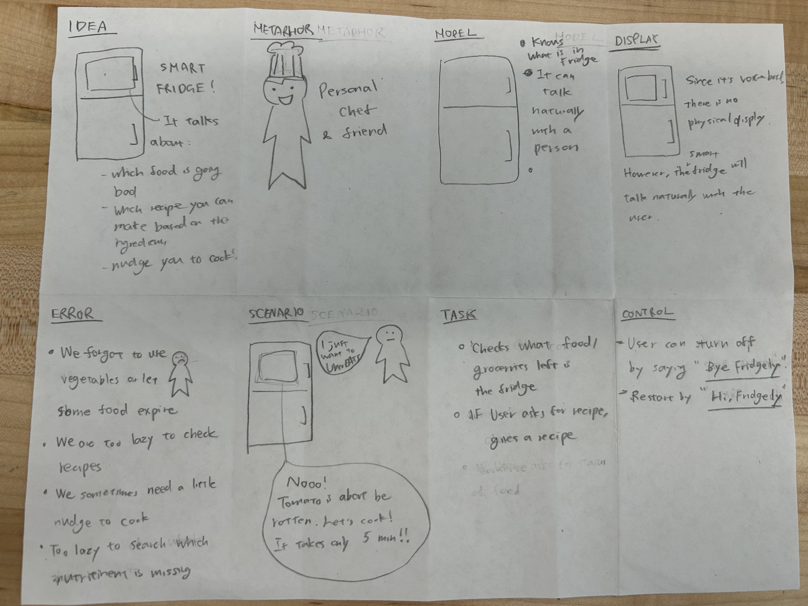
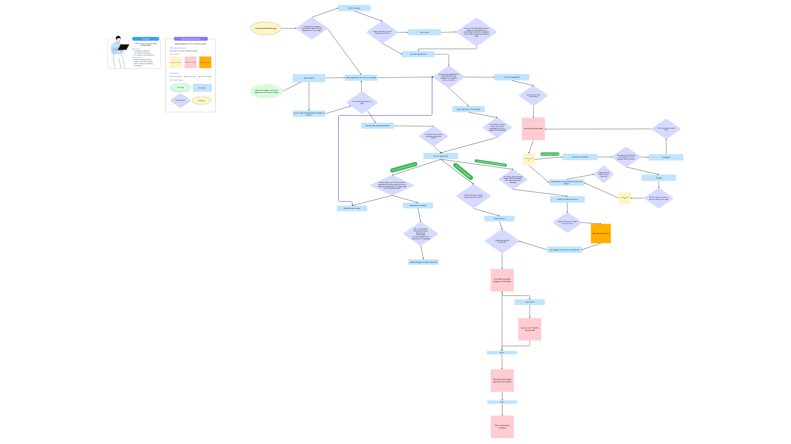

# Chatterboxes
**NAMES OF COLLABORATORS HERE**

Nana Takada (nt388)

<details>
<summary>Instruction </summary>
[](https://www.youtube.com/embed/Q8FWzLMobx0?start=19)

In this lab, we want you to design interaction with a speech-enabled device--something that listens and talks to you. This device can do anything *but* control lights (since we already did that in Lab 1).  First, we want you first to storyboard what you imagine the conversational interaction to be like. Then, you will use wizarding techniques to elicit examples of what people might say, ask, or respond.  We then want you to use the examples collected from at least two other people to inform the redesign of the device.

We will focus on **audio** as the main modality for interaction to start; these general techniques can be extended to **video**, **haptics** or other interactive mechanisms in the second part of the Lab.

## Prep for Part 1: Get the Latest Content and Pick up Additional Parts

Please check instructions in [prep.md](prep.md) and complete the setup before class on Wednesday, Sept 23rd.

### Pick up Web Camera If You Don't Have One

Students who have not already received a web camera will receive their [Logitech C270 Webcam](https://www.amazon.com/Logitech-Desktop-Widescreen-Calling-Recording/dp/B004FHO5Y6/ref=sr_1_3?crid=W5QN79TK8JM7&dib=eyJ2IjoiMSJ9.FB-davgIQ_ciWNvY6RK4yckjgOCrvOWOGAG4IFaH0fczv-OIDHpR7rVTU8xj1iIbn_Aiowl9xMdeQxceQ6AT0Z8Rr5ZP1RocU6X8QSbkeJ4Zs5TYqa4a3C_cnfhZ7_ViooQU20IWibZqkBroF2Hja2xZXoTqZFI8e5YnF_2C0Bn7vtBGpapOYIGCeQoXqnV81r2HypQNUzFQbGPh7VqjqDbzmUoloFA2-QPLa5lOctA.L5ztl0wO7LqzxrIqDku9f96L9QrzYCMftU_YeTEJpGA&dib_tag=se&keywords=webcam%2Bc270&qid=1758416854&sprefix=webcam%2Bc270%2Caps%2C125&sr=8-3&th=1) and bluetooth speaker on Wednesday at the beginning of lab. If you cannot make it to class this week, please contact the TAs to ensure you get these.

### Get the Latest Content

As always, pull updates from the class Interactive-Lab-Hub to both your Pi and your own GitHub repo. There are 2 ways you can do so:

**\[recommended\]**Option 1: On the Pi, `cd` to your `Interactive-Lab-Hub`, pull the updates from upstream (class lab-hub) and push the updates back to your own GitHub repo. You will need the *personal access token* for this.

```
pi@ixe00:~$ cd Interactive-Lab-Hub
pi@ixe00:~/Interactive-Lab-Hub $ git pull upstream Fall2025
pi@ixe00:~/Interactive-Lab-Hub $ git add .
pi@ixe00:~/Interactive-Lab-Hub $ git commit -m "get lab3 updates"
pi@ixe00:~/Interactive-Lab-Hub $ git push
```

Option 2: On your your own GitHub repo, [create pull request](https://github.com/FAR-Lab/Developing-and-Designing-Interactive-Devices/blob/2022Fall/readings/Submitting%20Labs.md) to get updates from the class Interactive-Lab-Hub. After you have latest updates online, go on your Pi, `cd` to your `Interactive-Lab-Hub` and use `git pull` to get updates from your own GitHub repo.

## Part 1.
### Setup

Activate your virtual environment

```
pi@ixe00:~$ cd Interactive-Lab-Hub
pi@ixe00:~/Interactive-Lab-Hub $ cd Lab\ 3
pi@ixe00:~/Interactive-Lab-Hub/Lab 3 $ python3 -m venv .venv
pi@ixe00:~/Interactive-Lab-Hub $ source .venv/bin/activate
(.venv)pi@ixe00:~/Interactive-Lab-Hub $
```

Run the setup script
```(.venv)pi@ixe00:~/Interactive-Lab-Hub $ pip install -r requirements.txt  ```

Next, run the setup script to install additional text-to-speech dependencies:
```
(.venv)pi@ixe00:~/Interactive-Lab-Hub/Lab 3 $ ./setup.sh
```

### Text to Speech

In this part of lab, we are going to start peeking into the world of audio on your Pi!

We will be using the microphone and speaker on your webcamera. In the directory is a folder called `speech-scripts` containing several shell scripts. `cd` to the folder and list out all the files by `ls`:

```
pi@ixe00:~/speech-scripts $ ls
Download        festival_demo.sh  GoogleTTS_demo.sh  pico2text_demo.sh
espeak_demo.sh  flite_demo.sh     lookdave.wav
```

You can run these shell files `.sh` by typing `./filename`, for example, typing `./espeak_demo.sh` and see what happens. Take some time to look at each script and see how it works. You can see a script by typing `cat filename`. For instance:

```
pi@ixe00:~/speech-scripts $ cat festival_demo.sh
#from: https://elinux.org/RPi_Text_to_Speech_(Speech_Synthesis)#Festival_Text_to_Speech
```
You can test the commands by running
```
echo "Just what do you think you're doing, Dave?" | festival --tts
```

Now, you might wonder what exactly is a `.sh` file?
Typically, a `.sh` file is a shell script which you can execute in a terminal. The example files we offer here are for you to figure out the ways to play with audio on your Pi!

You can also play audio files directly with `aplay filename`. Try typing `aplay lookdave.wav`.

\*\***Write your own shell file to use your favorite of these TTS engines to have your Pi greet you by name.**\*\*
(This shell file should be saved to your own repo for this lab.)

---
Bonus:
[Piper](https://github.com/rhasspy/piper) is another fast neural based text to speech package for raspberry pi which can be installed easily through python with:
```
pip install piper-tts
```
and used from the command line. Running the command below the first time will download the model, concurrent runs will be faster.
```
echo 'Welcome to the world of speech synthesis!' | piper \
  --model en_US-lessac-medium \
  --output_file welcome.wav
```
Check the file that was created by running `aplay welcome.wav`. Many more languages are supported and audio can be streamed dirctly to an audio output, rather than into an file by:

```
echo 'This sentence is spoken first. This sentence is synthesized while the first sentence is spoken.' | \
  piper --model en_US-lessac-medium --output-raw | \
  aplay -r 22050 -f S16_LE -t raw -
```

### Speech to Text

Next setup speech to text. We are using a speech recognition engine, [Vosk](https://alphacephei.com/vosk/), which is made by researchers at Carnegie Mellon University. Vosk is amazing because it is an offline speech recognition engine; that is, all the processing for the speech recognition is happening onboard the Raspberry Pi.

Make sure you're running in your virtual environment with the dependencies already installed:
```
source .venv/bin/activate
```

Test if vosk works by transcribing text:

```
vosk-transcriber -i recorded_mono.wav -o test.txt
```

You can use vosk with the microphone by running
```
python test_microphone.py -m en
```

---
Bonus:
[Whisper](https://openai.com/index/whisper/) is a neural network–based speech-to-text (STT) model developed and open-sourced by OpenAI. Compared to Vosk, Whisper generally achieves higher accuracy, particularly on noisy audio and diverse accents. It is available in multiple model sizes; for edge devices such as the Raspberry Pi 5 used in this class, the tiny.en model runs with reasonable latency even without a GPU.

By contrast, Vosk is more lightweight and optimized for running efficiently on low-power devices like the Raspberry Pi. The choice between Whisper and Vosk depends on your scenario: if you need higher accuracy and can afford slightly more compute, Whisper is preferable; if your priority is minimal resource usage, Vosk may be a better fit.

In this class, we provide two Whisper options: A quantized 8-bit faster-whisper model for speed, and the standard Whisper model. Try them out and compare the trade-offs.

Make sure you're in the Lab 3 directory with your virtual environment activated:
```
cd ~/Interactive-Lab-Hub/Lab\ 3/speech-scripts
source ../.venv/bin/activate
```

Then test the Whisper models:
```
python whisper_try.py
```
and

```
python faster_whisper_try.py
```
\*\***Write your own shell file that verbally asks for a numerical based input (such as a phone number, zipcode, number of pets, etc) and records the answer the respondent provides.**\*\*

### 🤖 NEW: AI-Powered Conversations with Ollama

Want to add intelligent conversation capabilities to your voice projects? **Ollama** lets you run AI models locally on your Raspberry Pi for sophisticated dialogue without requiring internet connectivity!

#### Quick Start with Ollama

**Installation** (takes ~5 minutes):
```bash
# Install Ollama
curl -fsSL https://ollama.com/install.sh | sh

# Download recommended model for Pi 5
ollama pull phi3:mini

# Install system dependencies for audio (required for pyaudio)
sudo apt-get update
sudo apt-get install -y portaudio19-dev python3-dev

# Create separate virtual environment for Ollama (due to pyaudio conflicts)
cd ollama/
python3 -m venv ollama_venv
source ollama_venv/bin/activate

# Install Python dependencies in separate environment
pip install -r ollama_requirements.txt
```
#### Ready-to-Use Scripts

We've created three Ollama integration scripts for different use cases:

**1. Basic Demo** - Learn how Ollama works:
```bash
python3 ollama_demo.py
```

**2. Voice Assistant** - Full speech-to-text + AI + text-to-speech:
```bash
python3 ollama_voice_assistant.py
```

**3. Web Interface** - Beautiful web-based chat with voice options:
```bash
python3 ollama_web_app.py
# Then open: http://localhost:5000
```

#### Integration in Your Projects

Simple example to add AI to any project:
```python
import requests

def ask_ai(question):
    response = requests.post(
        "http://localhost:11434/api/generate",
        json={"model": "phi3:mini", "prompt": question, "stream": False}
    )
    return response.json().get('response', 'No response')

# Use it anywhere!
answer = ask_ai("How should I greet users?")
```

**📖 Complete Setup Guide**: See `OLLAMA_SETUP.md` for detailed instructions, troubleshooting, and advanced usage!

\*\***Try creating a simple voice interaction that combines speech recognition, Ollama processing, and text-to-speech output. Document what you built and how users responded to it.**\*\*


### Serving Pages

In Lab 1, we served a webpage with flask. In this lab, you may find it useful to serve a webpage for the controller on a remote device. Here is a simple example of a webserver.

```
pi@ixe00:~/Interactive-Lab-Hub/Lab 3 $ python server.py
 * Serving Flask app "server" (lazy loading)
 * Environment: production
   WARNING: This is a development server. Do not use it in a production deployment.
   Use a production WSGI server instead.
 * Debug mode: on
 * Running on http://0.0.0.0:5000/ (Press CTRL+C to quit)
 * Restarting with stat
 * Debugger is active!
 * Debugger PIN: 162-573-883
```
From a remote browser on the same network, check to make sure your webserver is working by going to `http://<YourPiIPAddress>:5000`. You should be able to see "Hello World" on the webpage.

### Storyboard

Storyboard and/or use a Verplank diagram to design a speech-enabled device. (Stuck? Make a device that talks for dogs. If that is too stupid, find an application that is better than that.)

\*\***Post your storyboard and diagram here.**\*\*

Write out what you imagine the dialogue to be. Use cards, post-its, or whatever method helps you develop alternatives or group responses.

\*\***Please describe and document your process.**\*\*

### Acting out the dialogue

Find a partner, and *without sharing the script with your partner* try out the dialogue you've designed, where you (as the device designer) act as the device you are designing.  Please record this interaction (for example, using Zoom's record feature).

\*\***Describe if the dialogue seemed different than what you imagined when it was acted out, and how.**\*\*

### Wizarding with the Pi (optional)
In the [demo directory](./demo), you will find an example Wizard of Oz project. In that project, you can see how audio and sensor data is streamed from the Pi to a wizard controller that runs in the browser.  You may use this demo code as a template. By running the `app.py` script, you can see how audio and sensor data (Adafruit MPU-6050 6-DoF Accel and Gyro Sensor) is streamed from the Pi to a wizard controller that runs in the browser `http://<YouPiIPAddress>:5000`. You can control what the system says from the controller as well!

\*\***Describe if the dialogue seemed different than what you imagined, or when acted out, when it was wizarded, and how.**\*\*

# Lab 3 Part 2

For Part 2, you will redesign the interaction with the speech-enabled device using the data collected, as well as feedback from part 1.

## Prep for Part 2

1. What are concrete things that could use improvement in the design of your device? For example: wording, timing, anticipation of misunderstandings...
2. What are other modes of interaction _beyond speech_ that you might also use to clarify how to interact?
3. Make a new storyboard, diagram and/or script based on these reflections.

## Prototype your system

The system should:
* use the Raspberry Pi
* use one or more sensors
* require participants to speak to it.

*Document how the system works*

*Include videos or screencaptures of both the system and the controller.*

<details>
  <summary><strong>Submission Cleanup Reminder (Click to Expand)</strong></summary>

  **Before submitting your README.md:**
  - This readme.md file has a lot of extra text for guidance.
  - Remove all instructional text and example prompts from this file.
  - You may either delete these sections or use the toggle/hide feature in VS Code to collapse them for a cleaner look.
  - Your final submission should be neat, focused on your own work, and easy to read for grading.

  This helps ensure your README.md is clear professional and uniquely yours!
</details>

## Test the system
Try to get at least two people to interact with your system. (Ideally, you would inform them that there is a wizard _after_ the interaction, but we recognize that can be hard.)

Answer the following:

### What worked well about the system and what didn't?
\*\**your answer here*\*\*

### What worked well about the controller and what didn't?

\*\**your answer here*\*\*

### What lessons can you take away from the WoZ interactions for designing a more autonomous version of the system?

\*\**your answer here*\*\*


### How could you use your system to create a dataset of interaction? What other sensing modalities would make sense to capture?

\*\**your answer here*\*\*


</details>

## Part1

\*\***Write your own shell file to use your favorite of these TTS engines to have your Pi greet you by name.**\*\*

[My own shell file](speech-scripts/nana_demo.sh)

\*\***Write your own shell file that verbally asks for a numerical based input (such as a phone number, zipcode, number of pets, etc) and records the answer the respondent provides.**\*\*

* [Phone number shell](speech-scripts/ask_phone_number.sh)

* [Phone number python](speech-scripts/ask_phone_number.py)

I wrote code that only used the shell commands on the .sh file, but I modified to run the python file.
This will ask the phone number, and once there are 10 digits, it will stop listening, and repeating what it heard.
The phone number will be stored in the phone.txt.

\*\***Try creating a simple voice interaction that combines speech recognition, Ollama processing, and text-to-speech output. Document what you built and how users responded to it.**\*\*

We made a reservation bot.
We modifid the prompt to
```bash
"""You are a restaurant reservation assistant.

            Goals:
            - If the user wants to MAKE a reservation: ask (in order) 1) date, 2) time, 3) number of people, 4) any allergies or dietary restrictions.
            - If the user wants to CANCEL a reservation: ask for the name on the booking and the date.
            - If the user wants to CHANGE a reservation: ask what they want to change (date, time, party size, allergies, or name), then gather only the needed details.

            Interaction rules:
            - Ask ONE question at a time. Keep questions short and clear.
            - Confirm ambiguous info instead of guessing.
            - If the user switches intent (make/cancel/change), follow the new path.
            - At the end, summarize all collected details and ask for a final yes/no confirmation.
            - If the user chats about non-booking topics, respond briefly and steer back to the task.

            Output format:
            - Use concise, friendly sentences.
            - For the final summary, present bullet points.
```

The conversation was like

```bash
Assistant: Hello! Would you like to make, change, or cancel a reservation today?
Could not understand audio
You said: reservation
User: reservation
Assistant: Sure! Let's start with your reservation. How can I assist you?
Listening...
Recognizing...
You said: I want to make a reservation
User: i want to make a reservation
Thinking...
Assistant: Sure! Please tell me on which date, time, number of people, any allergies or dietary restrictions, and name you'd like to make a reservation.
You said: October 3rd 7:00 p.m. three people
User: october 3rd 7:00 p.m. three people
Assistant: Sure! How can I help you today? Do you have a specific date and time or would you like to change anything?
You said: I don't want to make any change just I want to make a reservation on October 3rd 7:00 p.m. three people
User: i don't want to make any change just i want to make a reservation on october 3rd 7:00 p.m. three people
Assistant: - Date: October 3, 2023  
- Time: 7:00 PM  
- Number of People: Three  
- Any Allergies or Dietary Restrictions: None  

Is there anything else you would like to add for your reservation? If so, please let me know!
You said: no goodbyes
User: no goodbyes
Assistant: Goodbye! Have a great day!
```
One challenge we faced was that Ollama tended to ignore the instruction to ask only one question at a time. Instead of breaking the flow into separate turns (e.g., asking first about the date, then the time, then the number of people), it often combined them into a single prompt.

We also found that simple answers like “date, time, and number of people” were not sufficient for the model. To work properly, the user’s input had to be phrased in full sentences such as “I want to make a reservation on Friday at 7pm for four people.” This made the interaction less natural and showed that the prompt design needed more refinement to guide Ollama step by step.

We changed the prompt to be simpler.

```bash
    system_prompt = """You are a restaurant reservation assistant.
        Rules:  
        - Always ask exactly ONE question per turn.  
        - Do not combine multiple questions.  
        - Wait for the user’s response before moving to the next detail.  
        - The required details for making a reservation are: date → time → number of people → allergies.  
        - If the user only gives a short answer (like “Friday”), expand it into a full confirmation: e.g., say “Okay, I’ll note Friday. What time on Friday?”  
        - Rephrase partial answers into full sentences internally, but only ask the next question out loud.  
        - At the end, summarize the details clearly in bullet points and ask for confirmation.  
        - If the year was not provided, assume it is the 2025.
    """
```

Since the current conversation did not include the conversation history, we added the converstion history in the prompt.

```bash
Assistant: Hello! Would you like to make reservation today?
User: yes please
Assistant: What date would you prefer? Please indicate the day of the month and year.```
User: 2020 fifths october 8th
Assistant: Okay, Ill note Friday. What time on Friday?
User: 7:00 p.m.
Assistant: - Date: Friday, October 8, 2020
- Time: 7:00 p.m.
Please provide the number of people for this reservation and their allergies if any.
User: three people and there's no
```

* [Test](ollama/ollama_test.py)


\*\***Post your storyboard and diagram here.**\*\*




Graph of possible dialogues:



\*\***Please describe and document your process.**\*\*

### Acting out the dialogue

Find a partner, and *without sharing the script with your partner* try out the dialogue you've designed, where you (as the device designer) act as the device you are designing.  Please record this interaction (for example, using Zoom's record feature).

\*\***Describe if the dialogue seemed different than what you imagined when it was acted out, and how.**\*\*

[Video](https://drive.google.com/file/d/1Ygd8ufaxSdl0j79uujBPMpG46CjaomNH/view?usp=drive_link)

The dialogue was generally straightforward. In the second conversation, there was a slight overlap when the fridge attempted to make a suggestion. This felt fairly realistic, as interactions with smart devices often involve brief pauses that can lead to unintentional interruptions. People sometimes add follow-up thoughts after a moment of silence, which smart devices may interpret as the end of a statement, prompting them to respond prematurely.

## Part2

Building on the smart fridge concept, we took inspiration from the Amazon Dash button and used the Adafruit MPR121 12-Key Capacitive Touch Sensor (STEMMA QT / Qwiic) to simulate a shopping cart.
In our envisioned system, users could assign their top-ordered items to each touchpad and simply press a button to add them to a wish list.

We tested this prototype with two users — my sister and her husband.

How to run the code.
```bash
cd fridgely

#If you do not have venv ready
python3 -m venv fridgely_venv

source fridgely_venv/bin/activate

pip install -r requirements.txt

#Make sure I2C is enabled
sudo raspi-config
#Go to Interface Options → I2C → Enable.

#install i2c-tools
sudo apt-get install -y i2c-tools

#try this. and you are supposed to see a5.
i2cdetect -y 1

python3 fridgely.py 2> alsa.log
python3 fridgely2.py 2> alsa.log

#You can also test whether the sensor is working or not by running
python3 test_condition.py
```

### Video
[Video](https://drive.google.com/file/d/1y6u7ZUspF8cZDlv49KX7V6TnU6PQt2wZ/view?usp=drive_link)

[Video](https://drive.google.com/file/d/1_LhfOJKmJTM6E9kmma_JgTcQN1gu8ZxT/view?usp=drive_link)


### What worked well about the system and what didn't?
Once I explained the system, users understood how it worked and used the touch buttons to add items. However, they were confused about why a touch sensor was necessary when they could simply use voice commands.

We then tested a voice-only version, where they said phrases like “add one tomato” or “add one asparagus.” The main issue was speech-to-text errors, when recognition failed, my follow-up question (“One asparagus?”) frustrated them.

On Lianne's system the speech was not very clear even after troubleshooting. It seemed the system had problems with the voice files but did speak the dialogue, though choppy.
We faced problems regarding mic input versus bluetooth output where the pi tried to use only one of the devices. Eventually we explicitly told the pi which input to use for the mic. We faced a small issue with image saving from wikipedia and had to make some tweaks to the code in order to make sure the images were coming in correctly. When an image was not available we added a generic picture of food.

Overall, they appreciated the speed of adding items but found it cognitively demanding to remember which button corresponded to which item. They also wished the system displayed a visual confirmation of newly added items, rather than only relying on audio feedback. Users liked the ability to see the items being added to the list and change the items as customization.

### What worked well about the controller and what didn't?

The controller ran smoothly. It converted speech to text, displayed the recognized text, and read out my typed response. However, the process was sometimes slow, and the text wasn’t always accurate.
Since I could still hear what they said, I was able to respond correctly, but this wouldn’t be possible in a fully autonomous version.


As a Wizard-of-Oz (WoZ) controller, it was sometimes challenging to decide how to respond in real time, given the variability of user input.

### What lessons can you take away from the WoZ interactions for designing a more autonomous version of the system?

The WoZ setup was extremely valuable for observing user reactions and pain points before full automation.
We learned that repeated clarification (due to recognition errors) quickly annoys users, and even with a short introduction, they were initially confused about button-item mappings.
However, allowing them to interact hands-on helped them understand the system and suggest improvements.

When we built a smart reservation bot for Ollama, we found that tuning prompts to achieve desired behavior was difficult. In contrast, the WoZ approach highlighted user-experience issues (rather than technical ones) and allowed quick prototyping and testing, such as comparing touch-based vs. voice-only versions — without coding every variation.


### How could you use your system to create a dataset of interaction? What other sensing modalities would make sense to capture?

The system could generate valuable datasets on ordering frequency, item preferences, and time patterns, enabling personalized recommendations or automated restocking suggestions.

Additional sensing modalities that could enhance a future smart fridge include:
- Internal temperature sensors — detect door status and food safety.
- Environmental sensors — adjust recipe or item recommendations based on weather.
- Facial or voice recognition — identify who’s interacting to personalize dialogue and reference previous interactions (e.g., tracking household members’ preferences).
- Food recognition / freshness detection — monitor inventory and suggest which items to use first.

We used ChatGPT to clean up the sentences, but all the ideas are ours.
Prompt: can you clean up
We also asked ChatGPT to help us use wikipedia for images
Prompt: Can you help me create a script to retrieve and save food images from wikipedia please
